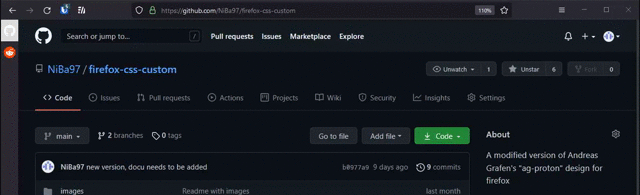

# Minimal Firefox Design

The older version is archived in the "old_version" branch. The new design features side tabs ([Sidebery](https://addons.mozilla.org/de/firefox/addon/sidebery/)) and a new unique look.

Note: The icons in the context menu are not from me! Find out more information about them [here](https://www.reddit.com/r/FirefoxCSS/comments/osles3/menu_icons/).

## Demonstration

## Installation

Paste the styles from the provided css styles into your firefox profile. Further, copy the sidebery styles into the plugins custom css area.

_Lookup [here](https://www.userchrome.org/how-create-userchrome-css.html) if you dont know how to modify your `userChrome.css`._
