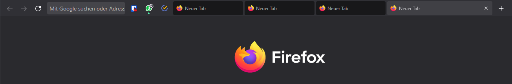
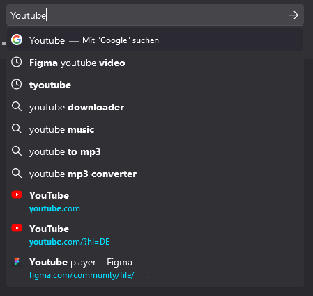
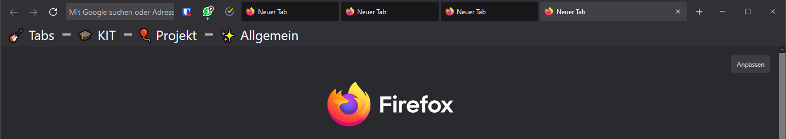

# Custom extension of the ag.proton design
A modified version of Andreas Grafen's ["ag-proton"](https://github.com/andreasgrafen/ag.proton) design for firefox.

## Overview of changes

- Address bar is highlighted
- Inactive tabs are darker
- Tabs size is increased
- Back and Forward navigation is displayed

 

  
Search previews are enabled.
*Copied form [this](https://www.reddit.com/r/FirefoxCSS/comments/nwre3i/agproton_based_on_simplerentfox_but_up_to_date/) reddit thread.*

 

- Bookmark-Size is increased for better accessibility
- Separator is redesigned

## Installation
Get the main `userChrome.css` from the original [project](https://github.com/andreasgrafen/ag.proton) and append the styles from the `customCss.css` of this repository.

*Lookup [here](https://www.userchrome.org/how-create-userchrome-css.html) if you dont know how to modify your `userChrome.-css`.*
